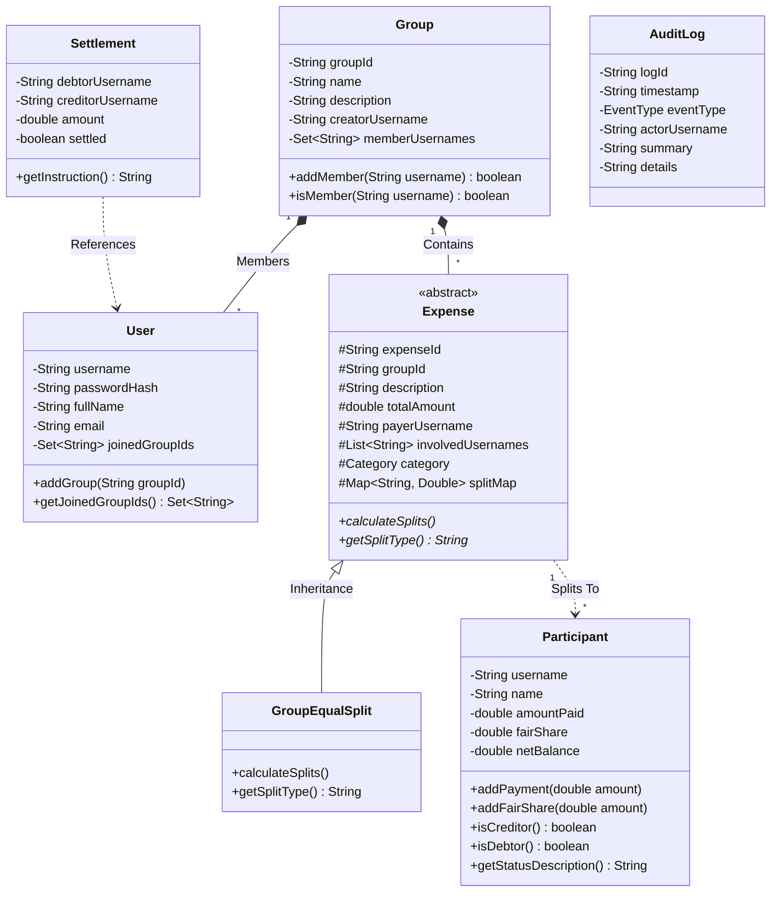

# EquiShare Pro ⚖️
### *An Automated Multi-Participant Expense Settlement & Financial Audit System*

[](https://www.oracle.com/java/)
[](https://en.wikipedia.org/wiki/Object-oriented_programming)
[](https://docs.oracle.com/javase/tutorial/uiswing/)
[](https://www.json.org/)
[-brightgreen?style=for-the-badge)](test.bat)
[](https://www.citchennai.edu.in/)

---

## 📖 Overview

**EquiShare Pro** is an automated, multi-participant financial utility application engineered in Java using **Object-Oriented Programming (OOP) paradigms** and pure Java zero-dependency persistence. 

Managing shared expenses across roommates, group trips, and collective events manually creates calculation errors, social disputes, and redundant bank transactions. EquiShare Pro eliminates this friction through:
- **Persistent Multi-User Sharing**: When User A enters an expense, User B logs in from anywhere on the system and immediately sees the updated ledger.
- **Two-Pointer Greedy Settlement Routing**: Minimizes the number of bilateral cash transfers required to settle all debts from naive $O(N^2)$ down to at most $N-1$.
- **Financial Audit & Invariant Engine**: Mathematically guarantees system transparency by verifying the Zero-Sum conservation invariant:
  $$\sum_{i=1}^{N} \text{Net Balance}_i = \sum_{i=1}^{N} (\text{Paid}_i - \text{FairShare}_i) = 0.00$$
- **Dual User Interface**: Includes both a modern **Java Swing Desktop GUI** with real-time KPI cards and a robust **Interactive Console CLI**.

---

## 🏛️ System Architecture Diagram

```mermaid
flowchart TD
    subgraph Presentation_Layer [Presentation Layer]
        GUI[🖥️ Java Swing GUI\nMainFrame / LoginDialog / ExpenseDialog]
        CLI[💻 Interactive Console CLI\nConsoleUI / ConsolePrinter]
    end

    subgraph Security_Validation [Security & Validation Layer]
        AUTH[🔒 Authentication Manager\nUser Session Controller]
        SEC[🛡️ SecurityUtils\nSHA-256 Password Hasher]
        VAL[✅ Domain Input Validator]
    end

    subgraph Service_Logic [Service & Algorithmic Layer]
        UM[👤 UserManager\nProfile & Registration Cache]
        GM[👥 GroupManager\nWorkspace & Join Code Engine]
        EM[💳 ExpenseManager\nLedger & Balance Sheet Aggregator]
        GREEDY[🚀 GreedySettlementCalculator\nTwo-Pointer Debt Minimization]
        AUDIT[📜 AuditService\nZero-Sum Invariant Verifier]
    end

    subgraph Domain_Model [Domain Object Models]
        M_USER[User]
        M_GRP[Group]
        M_EXP[abstract Expense]
        M_SPLIT[GroupEqualSplit]
        M_PART[Participant]
        M_SETTLE[Settlement]
        M_LOG[AuditLog]
    end

    subgraph Storage_Layer [Storage & Persistence Layer]
        SM[💾 StorageManager Interface]
        FSM[📁 FileStorageManager]
        JSON[⚡ SimpleJson Parser & Serializer\nPure Java / Zero Dependencies]
        DATA[(📂 data/ Directory\nusers.json | groups.json\nexpenses.json | audit_logs.json)]
    end

    GUI --> AUTH & VAL
    CLI --> AUTH & VAL
    AUTH --> SEC & UM
    VAL --> EM & GM
    UM & GM & EM --> Domain_Model
    EM --> GREEDY
    EM & GM --> AUDIT
    UM & GM & EM & AUDIT --> SM
    SM --> FSM
    FSM --> JSON
    JSON <--> DATA
```

---

## 📐 UML Domain Class Diagram



---

## ⚡ Key Algorithmic Innovations

### 1. Two-Pointer Greedy Settlement Routing Algorithm
Naive debt settlement requires $O(N^2)$ bilateral transfers. EquiShare Pro separates group members into **Creditors** (overpaid) and **Debtors** (underpaid), sorts both descending by magnitude, and matches the largest debtor directly with the largest creditor using a two-pointer approach:

```java
// Sort descending to settle largest amounts first
debtors.sort((a, b) -> Double.compare(b.amount, a.amount));
creditors.sort((a, b) -> Double.compare(b.amount, a.amount));

int d = 0, c = 0;
while (d < debtors.size() && c < creditors.size()) {
    BalanceEntry debtor = debtors.get(d);
    BalanceEntry creditor = creditors.get(c);

    double exchange = Math.min(debtor.amount, creditor.amount);
    settlements.add(new Settlement(debtor.username, debtor.name, 
                                   creditor.username, creditor.name, exchange));

    debtor.amount -= exchange;
    creditor.amount -= exchange;

    if (debtor.amount <= 0.009) d++;
    if (creditor.amount <= 0.009) c++;
}
```
**Result**: In a 3-person group where Alice paid ₹1200, Bob paid ₹600, and Charlie paid ₹0 (₹600 fair share each):
- Naive model: Charlie pays Alice ₹400, Charlie pays Bob ₹200, Bob pays Alice ₹200 (3 transactions).
- **EquiShare Pro**: Charlie transfers ₹600 directly to Alice (**1 single transaction**).

### 2. Mathematical Zero-Sum Ledger Invariant Engine
The system audits the financial health of the ledger across all mutations:
$$\text{Check 1: } \left| \sum \text{Total Expenses} - \sum \text{Amounts Paid} \right| < 0.05$$
$$\text{Check 2: } \left| \sum \text{Total Expenses} - \sum \text{Allocated Shares} \right| < 0.05$$
$$\text{Check 3: } \left| \sum \text{Net Balances} \right| < 0.05 \quad (\text{Zero-Sum Conservation})$$

---

## 🗂️ Project Directory Structure

```
equishare-pro/
├── src/
│   └── com/equishare/
│       ├── model/
│       │   ├── Category.java            # Enum for expense categories (Food, Travel, etc.)
│       │   ├── User.java                # User credentials, profile & joined group IDs
│       │   ├── Participant.java         # Participant ledger record (Paid, Share, Net)
│       │   ├── Expense.java             # Abstract base class for expenses
│       │   ├── GroupEqualSplit.java     # Concrete equal division with penny distribution
│       │   ├── Group.java               # Group workspace container & member roster
│       │   ├── Settlement.java          # Actionable debt transfer entity
│       │   └── AuditLog.java            # Immutable audit trail record
│       ├── service/
│       │   ├── UserManager.java         # Registration, SHA-256 login & user cache
│       │   ├── GroupManager.java        # Group creation, join codes (GRP-101) & queries
│       │   ├── ExpenseManager.java      # Expense CRUD, category filtering & balance aggregation
│       │   ├── SettlementCalculator.java# Strategy interface for debt simplification
│       │   ├── GreedySettlementCalculator.java # Two-pointer greedy settlement router
│       │   ├── AuditService.java        # Financial audit trail & zero-sum invariant verifier
│       │   └── AuthenticationManager.java# User session state holder
│       ├── storage/
│       │   ├── StorageManager.java      # Persistence abstraction contract
│       │   └── FileStorageManager.java  # Pure Java human-readable JSON storage
│       ├── exception/
│       │   ├── EquiShareException.java  # Root custom application exception
│       │   ├── AuthenticationException.java
│       │   ├── ValidationException.java
│       │   └── ResourceNotFoundException.java
│       ├── util/
│       │   ├── SimpleJson.java          # Zero-dependency recursive JSON parser & serializer
│       │   ├── SecurityUtils.java       # SHA-256 cryptographic password hashing
│       │   ├── DateUtils.java           # ISO-8601 date formatting and validation
│       │   └── SampleDataSeeder.java    # Seeds demo accounts and expenses on first run
│       ├── ui/
│       │   ├── cli/
│       │   │   ├── ConsolePrinter.java  # Generic header utility & formatted ASCII tables
│       │   │   └── ConsoleUI.java       # Interactive terminal menu workflow
│       │   └── swing/
│       │       ├── MainFrame.java       # Main dashboard window (Tabs, KPI Cards, Filters)
│       │       ├── LoginDialog.java     # Auth modal with 1-click evaluation buttons
│       │       └── ExpenseDialog.java   # Add/Edit modal with multi-member checklist
│       ├── Main.java                    # Dual-mode launcher (GUI by default, --cli flag)
│       └── WorkflowTest.java            # 12-suite automated test verification runner
├── data/                                # Persisted JSON storage files
│   ├── users.json
│   ├── groups.json
│   ├── expenses.json
│   └── audit_logs.json
├── docs/
│   └── PBL_Report.md                    # Complete academic report document
├── compile.bat                          # One-click Windows build script
├── run.bat                              # One-click Swing GUI launcher
├── run-cli.bat                          # One-click Terminal CLI launcher
├── test.bat                             # One-click automated test runner
├── .gitignore
└── README.md
```

---

## 🚀 Getting Started

### Prerequisites
- **Java SE Development Kit (JDK 17, 21, or 25 LTS)** installed and added to `PATH`.
- No Maven, Gradle, or external dependencies required!

### 1. Clone the Repository
```bash
git clone https://github.com/keerthanamg1905/JAVA-PBL.git
cd JAVA-PBL
```

### 2. Compile the Project
```bat
compile.bat
```
*(Or via standard command: `javac -encoding UTF-8 -d bin src/com/equishare/model/*.java src/com/equishare/service/*.java src/com/equishare/storage/*.java src/com/equishare/exception/*.java src/com/equishare/util/*.java src/com/equishare/ui/cli/*.java src/com/equishare/ui/swing/*.java src/com/equishare/Main.java src/com/equishare/WorkflowTest.java`)*

### 3. Launch the Swing GUI (Default)
```bat
run.bat
```
*(Or: `java -cp bin com.equishare.Main`)*

### 4. Launch the Interactive Console CLI
```bat
run-cli.bat
```
*(Or: `java -cp bin com.equishare.Main --cli`)*

### 5. Run the Automated 12-Suite Test Verification
```bat
test.bat
```
*(Or: `java -cp bin com.equishare.WorkflowTest`)*

---

## 👥 Evaluation Demo Accounts

On initial startup, sample data is automatically seeded with group **"Goa Vacation 2026" (ID: `GRP-101`)**:

| Username | Password | Full Name | Demo Role & Activity |
| :--- | :--- | :--- | :--- |
| `alice` | `password123` | Alice Sharma | Group Creator (Paid ₹1200 for Seafood Dinner) |
| `bob` | `password123` | Bob Verma | Member (Paid ₹600 for Rental Scooters) |
| `charlie` | `password123` | Charlie Singh | Member (Paid ₹300 for Museum Tickets) |

> 💡 **Quick Evaluation Tip**: In the GUI login window, click **Alice**, **Bob**, or **Charlie** to instantly authenticate with a single click!

---

## 🧪 Verification & Automated Test Results

The automated test runner (`WorkflowTest.java`) executes 12 end-to-end integration test suites:

```text
========================================================
     EQUISHARE PRO: AUTOMATED WORKFLOW TEST RUNNER     
========================================================

[1] Initializing Test Storage & Services...
[2] Registering 3 Users: Alice, Bob, Charlie...
  ✔ PASS: All 3 users registered
  ✔ PASS: Alice authentication successful
[3] Alice creates 'Goa Trip 2026' Group...
  ✔ PASS: Alice is member of created group
  ✔ PASS: Group has 3 active participants
[4] Alice adds Expense: ₹1200 for Seafood Dinner...
  ✔ PASS: Expense 1 recorded
[5] Verifying Shared Visibility: Bob logs in and views expenses...
  ✔ PASS: Bob sees exactly 1 expense added by Alice
  ✔ PASS: Bob sees Alice was the payer
  ✔ PASS: Bob sees ₹1200 amount
[6] Bob adds Expense: ₹600 for Rental Scooters...
  ✔ PASS: Expense 2 recorded
[7] Charlie logs in and inspects history (2 shared expenses)...
  ✔ PASS: Charlie sees both Alice's and Bob's expenses
[8] Verifying Individual Ledger Balances...
  ✔ PASS: Total group spend is ₹1800.00
  ✔ PASS: Alice paid ₹1200 | Fair share: ₹600 | Net: +₹600 (Receivable)
  ✔ PASS: Bob paid ₹600   | Fair share: ₹600 | Net: ₹0.00 (Settled)
  ✔ PASS: Charlie paid ₹0 | Fair share: ₹600 | Net: -₹600 (Owes)
[9] Verifying Greedy Debt Settlement Calculation...
  ✔ PASS: Optimized to exactly 1 transfer (Charlie -> Alice ₹600.00)
[10] Running Financial Audit & Zero-Sum Invariant Check...
  ✔ PASS: Ledger integrity check PASSED with 0 discrepancies (Δ = 0.0000)
  ✔ PASS: Sum of net balances is 0.00 (Zero-Sum Invariant)
[11] Testing Expense Editing & Recalculation...
  ✔ PASS: Total updated to ₹2100.00
[12] Testing Persistence across application restart...
  ✔ PASS: Persisted users, groups, expenses, and audit logs reloaded

========================================================
  🎉 ALL 12 VERIFICATION SUITES PASSED SUCCESSFULLY!    
========================================================
```

---

## 🎓 Academic Affiliation

- **Course:** Project-Based Learning (PBL) in Java Programming
- **Degree:** Bachelor of Engineering in Computer Science and Engineering
- **Institution:** Chennai Institute of Technology (Autonomous), Chennai – 600069
- **Academic Year:** 2026–2027

---

## 📄 License
This project is developed for educational and academic purposes under the [MIT License](LICENSE).
